##  System Workflow  

### 1. Authentication & Access Control  
- The system starts with a **login form**.  
- After successful login, the user is redirected to the **Main Menu**.  

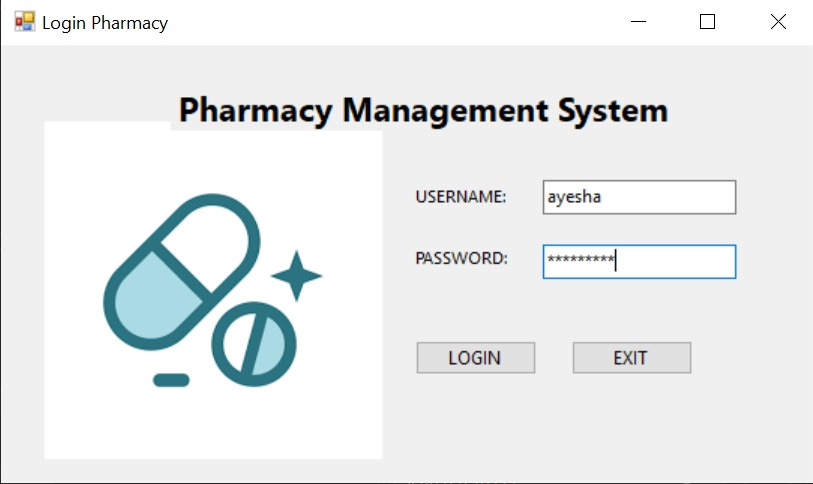

---

### 2. Main Menu (Navigation Hub)  
- Provides access to different modules:  
  - **Customer Management**  
  - **Medicine Inventory**  
  - **Prescription Handling**  
  - **Sales & Billing**  
- Includes a **Logout option** for secure exit.  

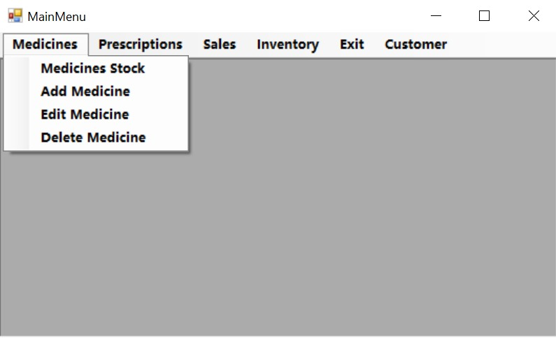  
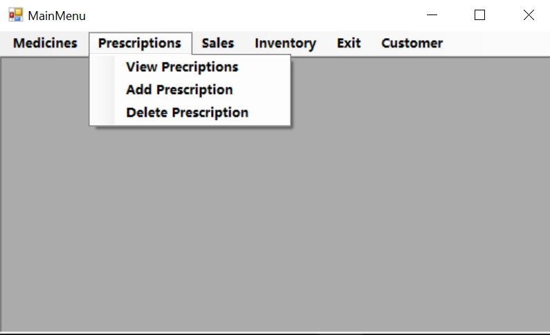  
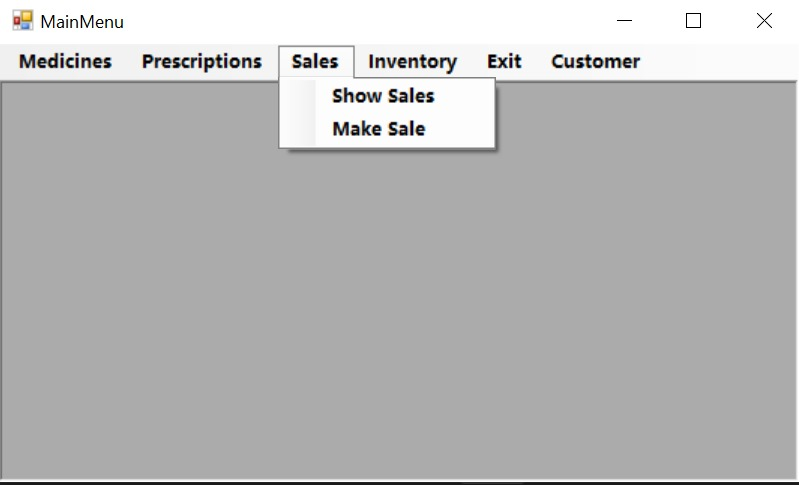  
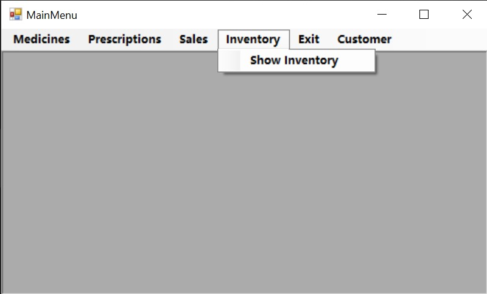  
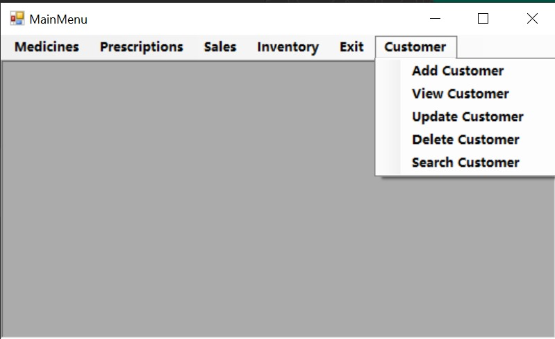  
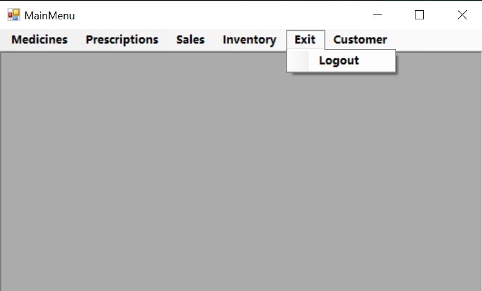  

---

### 3. Modules Workflow  

####  Customer Module  
- Add, update, delete, and search customers.  
- Customer data is linked to prescriptions.  

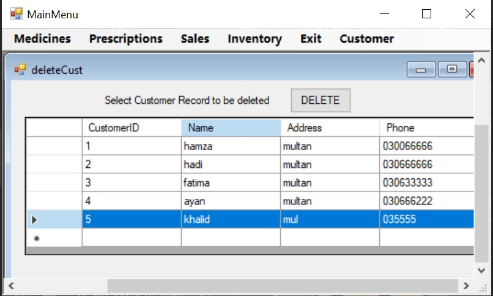

---

####  Medicine Module  
- Manage stock (insert/update/delete/search).  
- Medicines are directly connected to sales and prescriptions.  

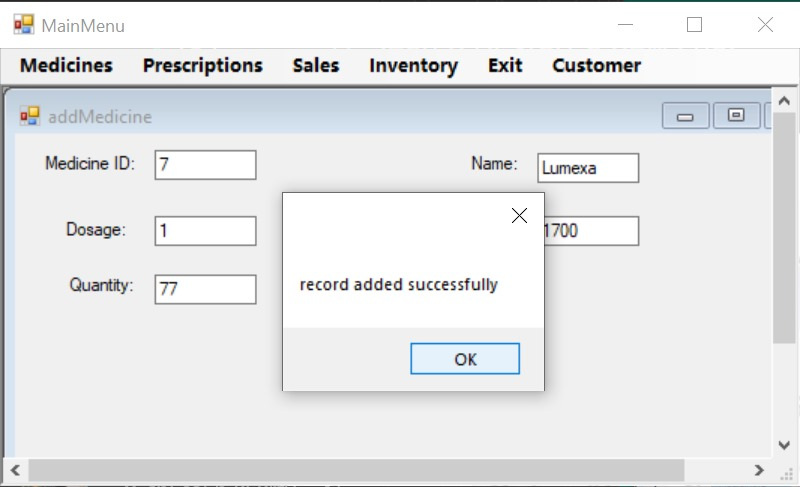  
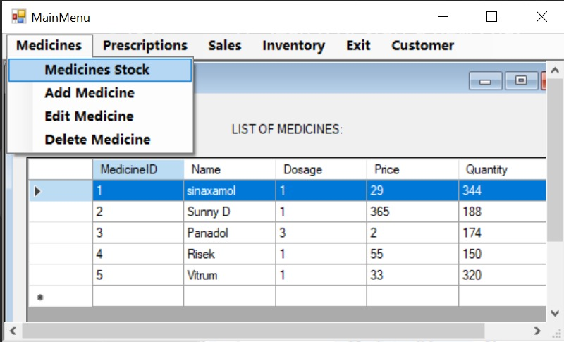

---

####  Prescription Module  
- Handles prescriptions linked with **customers** and **medicines**.  
- Supports adding, deleting, and viewing prescriptions.  

*(Image: Already shown in main-menu2 for prescriptions section)*

---

####  Sales Module  
- Handles medicine selling, updates inventory in real time, and stores billing records.  

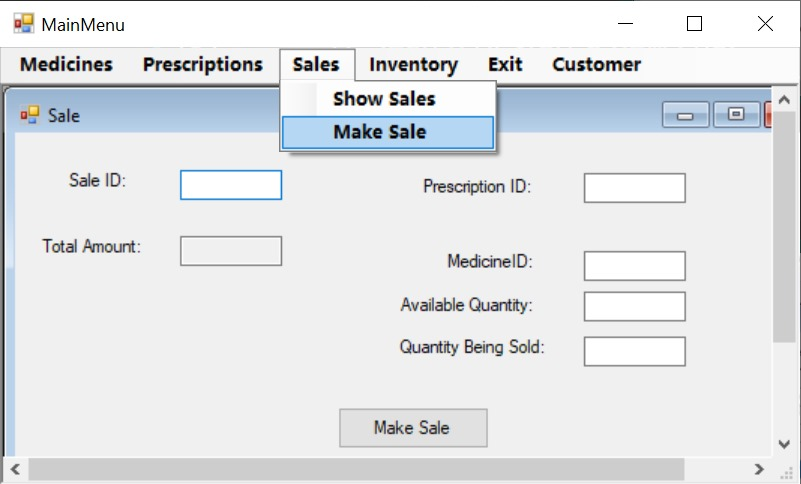

---

#### 📦 Inventory Module  
- Real-time stock monitoring.  
- Allows searching medicines and viewing available quantities.  

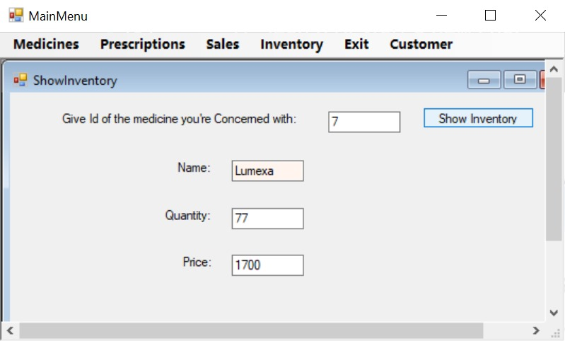
